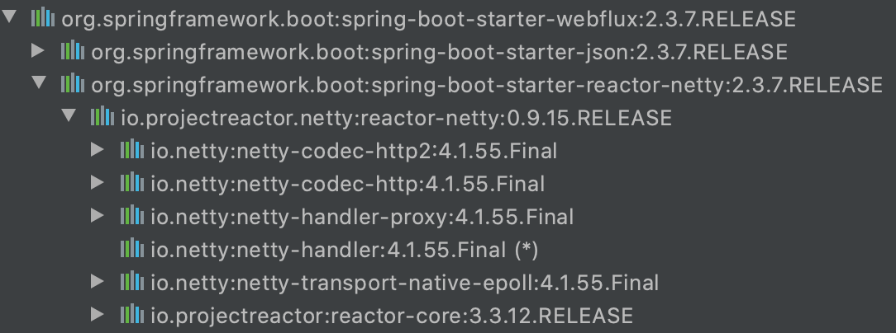
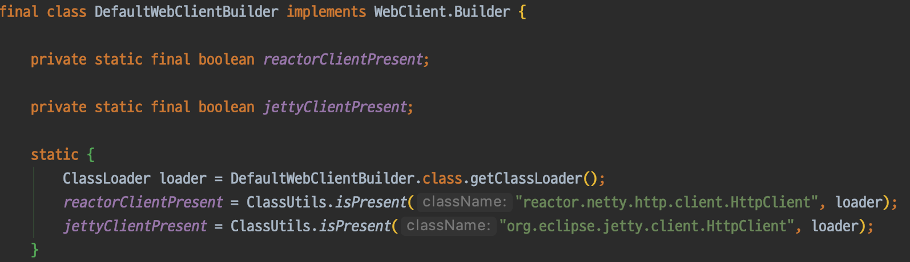
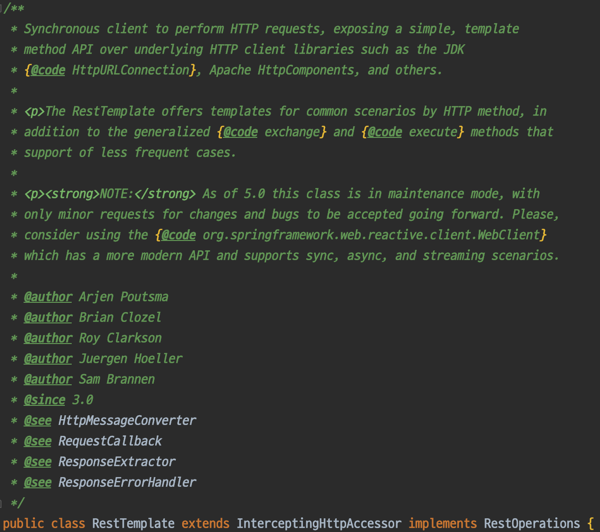

# WebClient

Spring 5에 새로 추가된 WebClient는 HTTP 요청을 할 때 사용하는 클라이언트 라이브러리이다. 애플리케이션에서 WebClient를 사용하려면 build.gradle 파일에 `spring-boot-starter-webflux` 선언 하면 자동으로 추가된다. 



요청을 보내기 위해서 내부적으로 HTTP 클라이언트를 사용한다. 기본값은 Reactor Netty의 [HttpClient](https://projectreactor.io/docs/netty/0.8.4.RELEASE/api/reactor/netty/http/client/HttpClient.html) 를 사용한다. Reactor Netty 이외에도 다양한 HttpClient를 지원한다.

- [Reactor Netty](https://github.com/reactor/reactor-netty)
- [Jetty Reactive HttpClient](https://github.com/jetty-project/jetty-reactive-httpclient)
- [Apache HttpComponents](https://hc.apache.org/index.html)



## WebClient 특징
- non-blocking
- asynchronous
- synchronous
- streaming

## RestTemplate에서 WebClient으로 이동
`RestTemplate`은 Spring 3 버전부터 지금까지 자주 사용하는 HTTP 클라이언트 라이브러리이다. 그동안 잘쓰던 `RestTemplate` 에서 `WebClient` 로 변경해야 하는 이유는 `RestTemplate`은 새로운 기능이 더 이상 추가되지 않고 유지보수 모드로 들어가기 때문이다.



기존에 작성된 RestTemplate을 지금 당장 모두 들어내고 WebClient로 교체 할 필요는 없다. 문제 없이 잘 동작 하는 코드는 그대로 두고 비동기&논블록킹을 사용해야 하는 경우에만 WebClient를 적용하자.

## Mono와 Flux
Mono와 Flux는 Reactvie Stream의 Publisher 인터페이스를 구현한 클래스이다.

- Mono: 0 또는 1개의 결과만을 처리하는 Reactor 객체
- Flux: 0 또는 N개인 여러 개의 결과를 처리하는 Reactor 객체

## WebClient 예제
 
### WebClient 생성

```
HttpClient httpClient = HttpClient.create()
        .tcpConfiguration(tcpClient ->
                tcpClient.option(ChannelOption.CONNECT_TIMEOUT_MILLIS, 10000) // connection timeout
                        .doOnConnected(conn -> conn
                                .addHandlerLast(new ReadTimeoutHandler(10)) // read timeout
                                .addHandlerLast(new WriteTimeoutHandler(10)))); // write timeout

WebClient webClient = WebClient.builder()
        .codecs(configurer -> configurer.defaultCodecs().maxInMemorySize(2 * 1024 * 1024))
        .clientConnector(new ReactorClientHttpConnector(httpClient))
        .build();
```

### retrieve
 
### exchange

### Request Body

```
Flux<Person> personFlux = ... ;

Mono<Void> result = client.post()
        .uri("/persons/{id}", id)
        .contentType(MediaType.APPLICATION_STREAM_JSON)
        .body(personFlux, Person.class)
        .retrieve()
        .bodyToMono(Void.class);
```

```
Mono<Void> result = client.post()
        .uri("/persons/{id}", id)
        .contentType(MediaType.APPLICATION_JSON)
        .bodyValue(person)
        .retrieve()
        .bodyToMono(Void.class);
```

### Form Data
`FormHttpMessageWriter` 클래스가 자동으로 application/x-www-form-urlencoded 을 content에 붙여준다.

```
MultiValueMap<String, String> formData = ... ;

Mono<Void> result = client.post()
        .uri("/path", id)
        .bodyValue(formData)
        .retrieve()
        .bodyToMono(Void.class);
```

### Filters

```
WebClient client = WebClient.builder()
        .filter((request, next) -> {

            ClientRequest filtered = ClientRequest.from(request)
                    .header("foo", "bar")
                    .build();

            return next.exchange(filtered);
        })
        .build();
```

### Attributes

```
WebClient client = WebClient.builder()
        .filter((request, next) -> {
            Optional<Object> usr = request.attribute("myAttribute");
            // ...
        })
        .build();

client.get().uri("https://example.org/")
        .attribute("myAttribute", "...")
        .retrieve()
        .bodyToMono(Void.class);
```

### Synchronous
`WebClient`를 사용해서 블로킹 동기 방식으로 호출할 수 있다.

```
Person person = client.get().uri("/person/{id}", i).retrieve()
    .bodyToMono(Person.class)
    .block();

List<Person> persons = client.get().uri("/persons").retrieve()
    .bodyToFlux(Person.class)
    .collectList()
    .block();
```

### Testing

## References
- [WebClient docs](https://docs.spring.io/spring-framework/docs/current/reference/html/web-reactive.html#webflux-client)